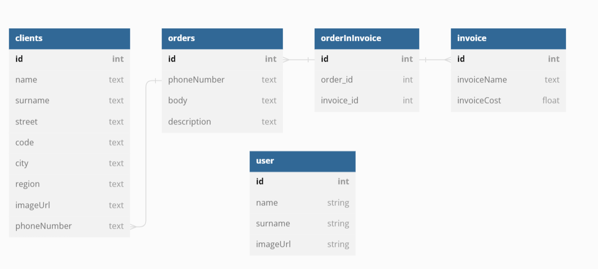

<br>

# General info

CRUD Application version beta
<br>
<br>

<br>

<br>

# Technologies:

- ReactJS
- React Context
- React Route
- Redux
- Library:

```
@mui/material
@tanstack/react-query
formik
yup
react-error-boundary
react-multistep
```

<br>

<br>

# Setup

To run this project, install it locally using npm:

```
$ npm install
$ npx json-server --watch db.json on localhost:3000 port
$ npm start on localhost:3001
```

</br>


# Project Status

Project is _in progress_

</br>


